# Tutorial: Rede Wi-Fi Corporativa com LAP e WLC no Cisco Packet Tracer

**Nível:** Intermediário  
**Ferramenta:** Cisco Packet Tracer  
**Objetivo:** Simular uma infraestrutura de rede sem fio corporativa utilizando um Lightweight Access Point (LAP) gerenciado por uma Wireless LAN Controller (WLC).

---

## Conceito: Por que LAP + WLC?

Na sua casa ou em pequenas empresas, usamos um **Access Point comum (autônomo)**, que funciona sozinho. 

Em ambientes corporativos (shoppings, universidades, hospitais), existem **dezenas ou centenas de APs** espalhados pelo prédio. Configurar cada um separadamente seria inviável. Por isso, usamos:

- **LAP (Lightweight Access Point):** Um AP "burro" que **não funciona sozinho**. Ele depende de uma controladora para receber as configurações (nome da rede, senha, canal, etc.).
- **WLC (Wireless LAN Controller):** O "cérebro" da rede Wi-Fi. Gerencia todos os LAPs de forma centralizada.

> Essa arquitetura permite que um administrador altere a senha do Wi-Fi de todos os 200 APs de um prédio em **um único clique**.

---

## Equipamentos Necessários

| Equipamento | Quantidade | Função |
|---|---|---|
| Switch 2960 | 1 | Interligar todos os equipamentos |
| WLC-PT | 1 | Controladora Wi-Fi (gerencia o LAP) |
| LAP-PT | 1 | Ponto de Acesso sem fio (transmite o Wi-Fi) |
| Server-PT | 1 | Servidor DHCP (distribui IPs automaticamente) |
| PC-PT | 2 | Clientes da rede Wi-Fi |

---

## Passo 1: Inserindo os Equipamentos

Abra um **novo arquivo em branco** no Packet Tracer (File > New) e adicione os equipamentos abaixo. Por enquanto, apenas coloque-os na tela sem conectar nenhum cabo.

**Como encontrar cada equipamento no menu inferior:**

| Equipamento | Categoria | Subcategoria |
|---|---|---|
| Switch 2960 | Network Devices | Switches |
| WLC-PT | Network Devices | Wireless Devices |
| LAP-PT | Network Devices | Wireless Devices |
| Server-PT | End Devices | End Devices |
| PC-PT (x2) | End Devices | End Devices |

Organize-os na tela de forma clara, como no exemplo abaixo:

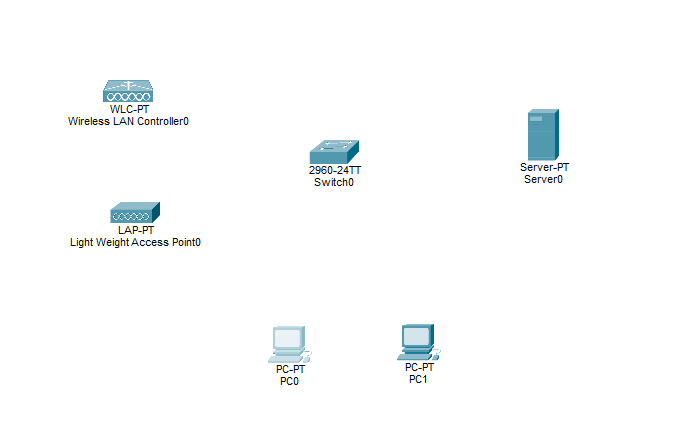

---

## Passo 2: Preparação Física

### 2.1 Conectando os Cabos

Vá na categoria **Connections** (ícone de raio laranja) e escolha o cabo **Copper Straight-Through** (cabo sólido preto).

Conecte ao **Switch0**:
- Server0 → Switch0
- WLC-PT → Switch0
- LAP-PT → Switch0

> ⚠️ **Atenção:** Os PCs **não** recebem cabo! Eles se conectarão via Wi-Fi.

### 2.2 Ligando o LAP na Tomada

O LAP-PT vem **desligado por padrão** no Packet Tracer. Esse é um dos erros mais comuns!

1. Clique no **LAP-PT** e vá na aba **Physical**.
2. No canto inferior direito, arraste a **fonte de energia** (retângulo preto) e solte-a no conector redondo do LAP.

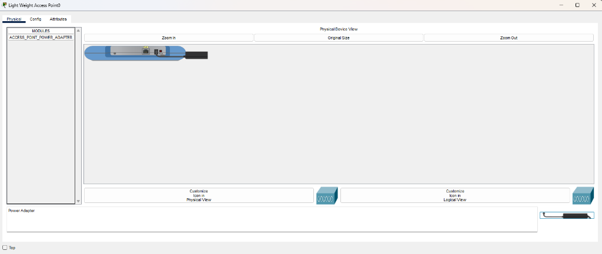

### 2.3 Trocando a Placa de Rede dos PCs

Os PCs vêm com placa de rede **com fio** por padrão. Precisamos trocá-la pela placa **Wi-Fi (WMP300N)**.

Repita este processo no **PC0** e no **PC1**:

1. Clique no PC e vá na aba **Physical**.
2. Clique na **bolinha vermelha** (botão de energia) para **desligar** o PC.
3. Arraste a placa de rede com fio (parte inferior do PC) para a lista da esquerda para **removê-la**.
4. Na lista **Modules** (esquerda), clique em **WMP300N**.
5. Arraste a plaquinha com antena para o buraco vazio no PC.
6. Clique novamente na bolinha para **ligar** o PC.

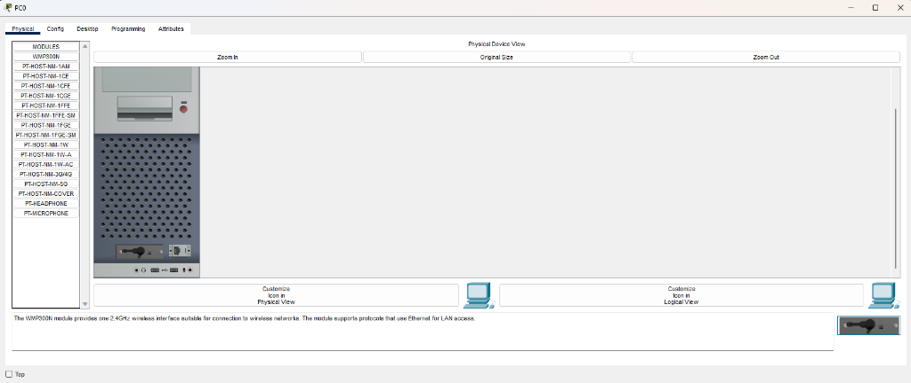

---

## Passo 3: Configurando os IPs da Infraestrutura

### 3.1 IP do Servidor

1. Clique no **Server0** e vá na aba **Config**.
2. No menu esquerdo (INTERFACE), clique em **FastEthernet0**.
3. Selecione **Static** e preencha:
   - **IPv4 Address:** `192.168.0.10`
   - **Subnet Mask:** `255.255.255.0`

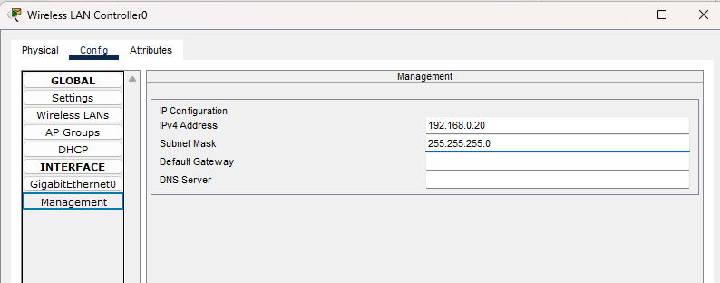

### 3.2 IP da Controladora (WLC)

1. Clique na **WLC-PT** e vá na aba **Config**.
2. No menu esquerdo (INTERFACE), clique em **Management**.
3. Preencha:
   - **IPv4 Address:** `192.168.0.20`
   - **Subnet Mask:** `255.255.255.0`

---

## Passo 4: Configurando o Servidor DHCP

O servidor DHCP é responsável por distribuir IPs automaticamente para o LAP e para os PCs. Ele também informa ao LAP **onde está a WLC** — sem isso, o LAP não funciona!

1. Clique no **Server0** e vá na aba **Services**.
2. No menu esquerdo, clique em **DHCP**.
3. Marque o serviço como **On**.
4. Preencha os campos:
   - **Start IP Address:** `192.168.0.100`
   - **Subnet Mask:** `255.255.255.0`
   - **WLC Address:** `192.168.0.20` ← **campo mais importante!**
5. Clique em **Save**.

> 💡 **Por que o WLC Address é tão importante?**  
> Quando o LAP liga e pede um IP ao servidor DHCP, o servidor responde com o IP **e** o endereço da WLC. O LAP então se conecta à WLC automaticamente e baixa todas as configurações de Wi-Fi.

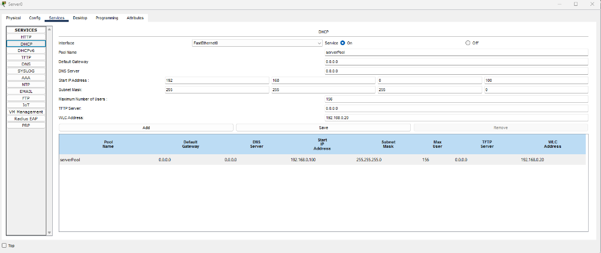

---

## Passo 5: Criando a Rede Wi-Fi na Controladora

Aqui é onde a mágica acontece! Vamos criar o nome e a senha do Wi-Fi **uma única vez** na WLC, e ela vai distribuir essa configuração para todos os LAPs da rede.

1. Clique na **WLC-PT** e vá na aba **Config**.
2. No menu esquerdo (GLOBAL), clique em **Wireless LANs**.
3. Preencha os campos:
   - **Profile Name:** `RedeAlunos`
   - **SSID:** `RedeAlunos`
   - **VLAN:** `1`
   - **Authentication:** `WPA2-PSK`
   - **PSK Pass Phrase:** `12345678`
4. Clique em **Save**.

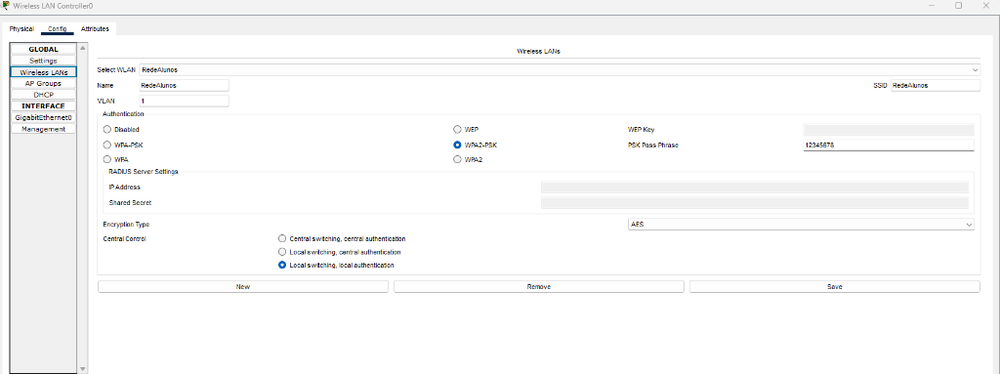

---

## Passo 6: Acelerando o Tempo e Conectando os PCs

### 6.1 Sincronização LAP ↔ WLC

Após salvar a configuração, o LAP precisa de alguns segundos para encontrar a WLC e "ligar" o sinal Wi-Fi.

> **Dica:** Clique algumas vezes no botão **Fast Forward Time** (ícone `>>` na barra inferior do Packet Tracer) para acelerar esse processo.

### 6.2 Conectando o PC0 ao Wi-Fi

1. Clique no **PC0** e vá na aba **Desktop**.
2. Clique no ícone **PC Wireless**.
3. Vá na aba **Connect** e clique em **Refresh**.
4. A rede `RedeAlunos` vai aparecer na lista. Selecione-a.

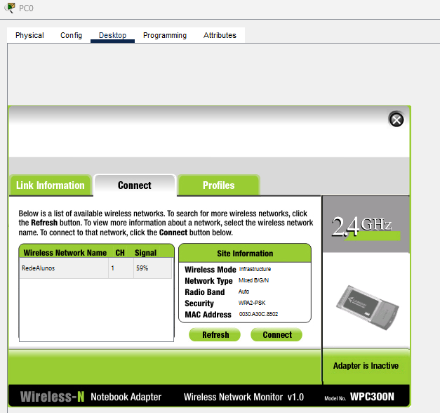

5. Com a rede selecionada (azul), clique no botão **Connect**.

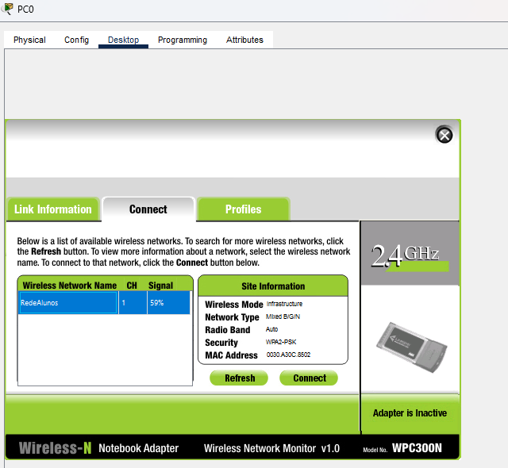

6. Na janela de autenticação, digite a senha `12345678` no campo **Pre-shared Key** e clique em **Connect**.

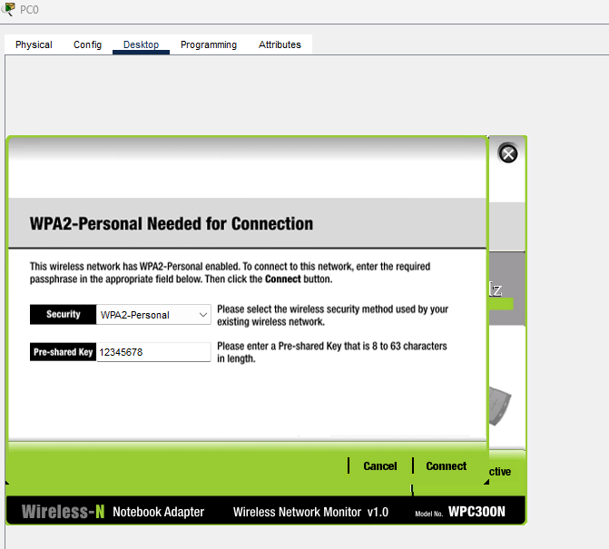

7. Após conectar, o status no canto inferior direito mudará de **"Adapter is Inactive"** para **"Adapter is Active"**.

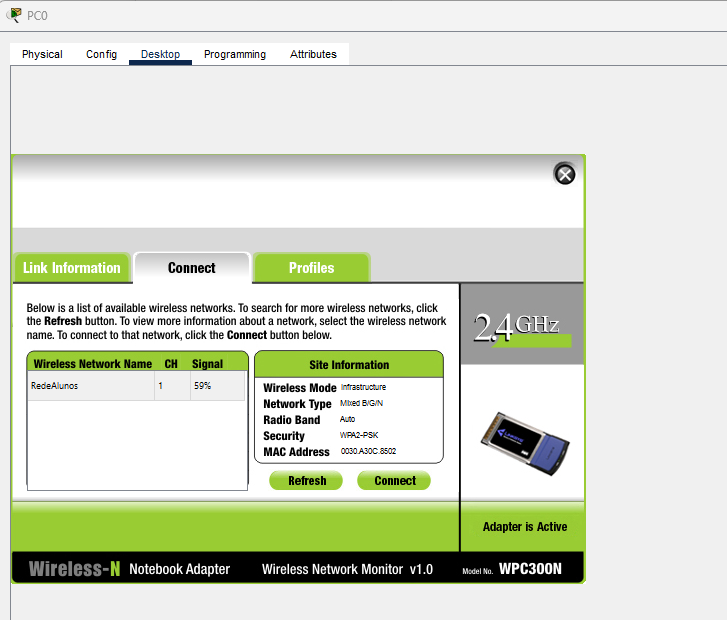

---

## Passo 7: Verificando o Funcionamento

### 7.1 Confirmando o IP (Prova que o DHCP funcionou)

1. Ainda no **PC0**, vá na aba **Desktop** > **IP Configuration**.
2. Confirme que o IP atribuído é `192.168.0.100` (via DHCP, pela interface Wireless0).

> Se aparecer `169.254.x.x`, o PC ainda não recebeu IP. Aguarde alguns segundos e atualize a tela.

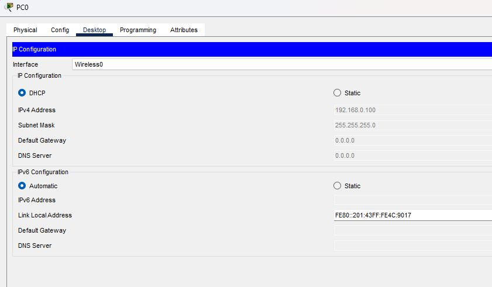

### 7.2 Conectando o PC1

Repita todo o **Passo 6** para o **PC1**. Ele receberá o IP `192.168.0.101`.

### 7.3 Testando a Comunicação entre os PCs

1. No **PC0**, vá em **Desktop** > **Command Prompt**.
2. Digite o comando abaixo e aperte **Enter**:
   ```
   ping 192.168.0.101
   ```
3. Se aparecerem respostas `Reply from 192.168.0.101...`, **a rede está 100% funcional!**

---

## Resultado Final

Com tudo configurado, a tela principal do Packet Tracer mostrará a topologia completa com as **linhas tracejadas** representando as conexões Wi-Fi entre os PCs e o LAP:

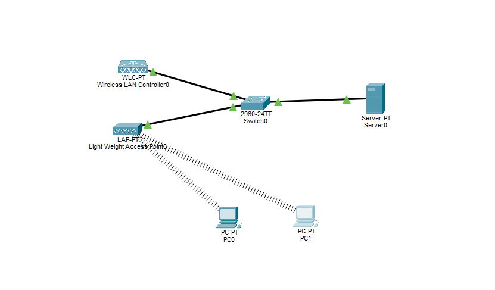

---

## Resumo da Configuração

| Equipamento | IP | Configuração |
|---|---|---|
| Server0 | `192.168.0.10` | Estático |
| WLC-PT | `192.168.0.20` | Estático (Management) |
| LAP-PT | `192.168.0.100` | Automático (DHCP) |
| PC0 | `192.168.0.100` | Automático (DHCP) |
| PC1 | `192.168.0.101` | Automático (DHCP) |

| Configuração Wi-Fi | Valor |
|---|---|
| **SSID (Nome da rede)** | `RedeAlunos` |
| **Segurança** | `WPA2-PSK` |
| **Senha** | `12345678` |
| **VLAN** | `1` |

---

*Tutorial criado com Cisco Packet Tracer para fins educacionais.*
